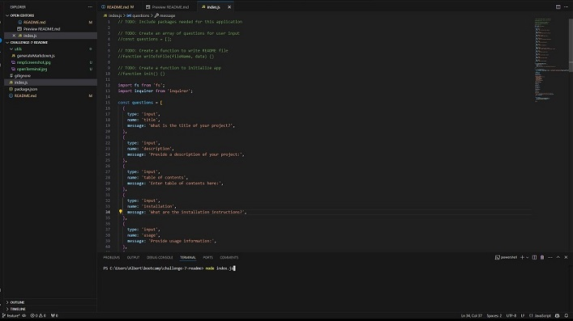

  # operationGenerateReadMe
  
  
  ## Description
  This command-line application dynamically generates a professional README.md file from a user's input using the Inquirer package
  
  ## Table of Contents
  - [Installation](#installation)
  - [Usage](#usage)
  - [Credits](#credits)
  - [License](#license)
  - [Features](#features)
  - [Tests](#tests)
  - [Questions](#questions)

  ## Walkthrough Video
[Watch the walkthrough video](link-to-your-video)

## Screenshots

  
  ## Installation
  To be used in conjunction with inquirer package. Down load inquirer package and clone the reposity: git clone https://github.com/your-username/readme-generator.git. 
  
  ## Usage
  You can use this product to automatically generate a README file for all your programming projects 
  
  ## Credits
  Jen Savino
  
  ## License
  No license selected.
  
  ## Features
  This product features only javascript, index files, nodes, and inquirer	
  
  ## Tests
  You can test the index.js file when you open the integrated terminal and type the command: node index.js. The program is functioning if you are prompted to answer questions for creating the readme file. 
  
  ## Questions
  If you have any questions, please feel free to contact me:
  
  - GitHub: [jsavino26](https://github.com/jsavino26)
  - Email: jensavino26@gmail.com
  